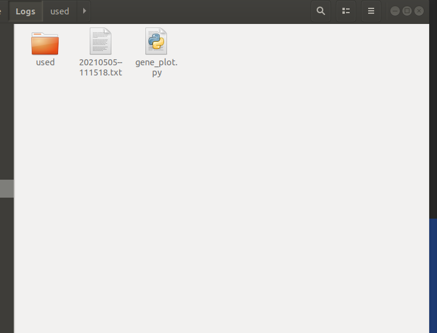
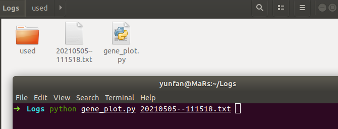
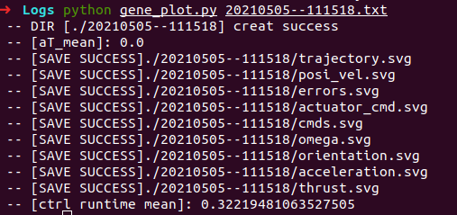
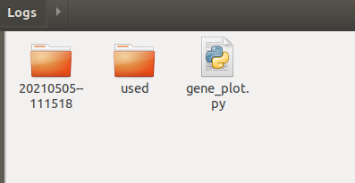
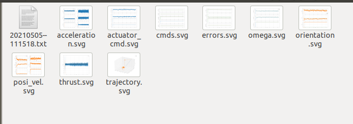

# Logs in MPC

# 1 C++

在c++代码中添加如下部分：

```cpp

#include "ctime"
#include "cstring"

const int MAIN_LOOP_FREQ = 30;
using namespace std;

static std::string getCurrentTimeStr() {
    time_t t = time(NULL);
    char ch[64] = {0};
    char result[100] = {0};
    strftime(ch, sizeof(ch) - 1, "%Y%m%d--%H%M%S", localtime(&t));
    sprintf(result, "%s", ch);
    return std::string(result);
}

 inline void generateLogFiles() {
/* Save log to disk */
        std::string filename = getCurrentTimeStr();
        filename = "/home/yunfan/Logs/" + filename + ".txt"; // 在这里填写希望的输出路径
        std::ofstream log_file(filename);
        std::ostream_iterator<Eigen::Matrix<float, 1, LOG_NUM>> log_iterator(log_file, "\n");
        log_t log_data;
        mpc_ptr_->getLogData(log_data);
        std::copy(log_data.begin(), log_data.end(), log_iterator);
        ROS_WARN("SAVE LOGS SUCCESS!");
    }
```

其中输出路径需要和`gene_plot.py`在同一目录下



随后在终端中运行



程序就会自动生产svg矢量图到同名文件夹，并且将原txt文件移动到同一文件夹下







